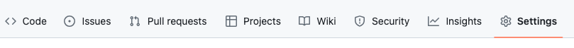
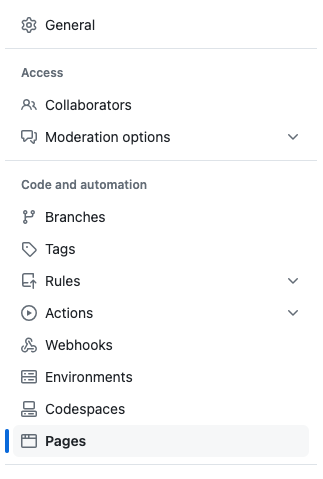
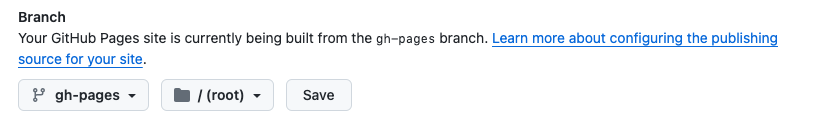

# Website

This website is built using [Docusaurus](https://docusaurus.io/), a modern static website generator.

### Installation

```sh
npm install
```

### Local Development

```sh
npm start
```

This command starts a local development server and opens up a browser window. Most changes are reflected live without having to restart the server.

### Build

```sh
npm run build
```

This command generates static content into the `build` directory and can be served using any static contents hosting service.

### Setup Deployment
To deploy using GitHub Pages you need to first enable it in the repo:
1. Under your repository name, click **Settings**. 


2. Under "Code and automation" section of the sidebar, click **Pages**



3. Under "Build and deployment", under "Branch", use the branch dropdown menu and select a publishing source.


4. Change your `docusaurus.config.ts` settings:
```ts
const config: Config = {
   // ...
   url: 'https://jmrocha.github.io',
   baseUrl: '/diracx',
   organizationName: 'jmrocha',
   projectName: 'diracx',
   deploymentBranch: 'gh-pages',
   trailingSlash: false,
   // ...
};
```

### Deployment
```sh
npm run deploy
```
